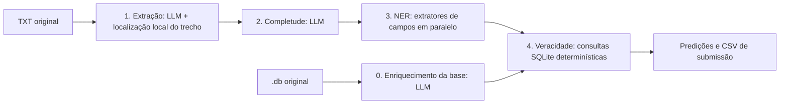

# Jusbrasil BRACIS 2026 — Caça-Alucinações

Este pipeline encontra citações jurídicas em documentos TXT, extrai seus campos estruturados e as verifica contra uma base SQLite canônica. Para cada citação, gera um trecho (span), uma classe (`real`, `inventada` ou `incompleta`), o ID canônico das citações reais e um valor de confiança.

Tudo roda offline em uma GPU de 24 GB de VRAM, com um único modelo aberto servido localmente pelo vLLM: [`google/gemma-4-12B-it-qat-w4a16-ct`](https://huggingface.co/google/gemma-4-12B-it-qat-w4a16-ct).

## Avaliação final: como executar

### Requisitos

- Linux com uma GPU NVIDIA de pelo menos 24 GB de VRAM (desenvolvido para uma RTX 4090), drivers NVIDIA recentes e o NVIDIA Container Toolkit.
- Docker. Nada mais é necessário no host: o vLLM, o Python e os pesos do modelo ficam na imagem.
- Acesso à internet **apenas para construir a imagem**, que baixa as dependências e os pesos do modelo. A execução não usa rede nem chama APIs externas.

### Build

```bash
docker build -t desafio-jusbrasil .
```

A imagem é baseada em `vllm/vllm-openai:v0.29.0` e baixa para dentro dela os pesos do modelo em uma revisão fixa (`1d2c2d7f2466070e69d6fb3fd5ce9a7d75f2f6ee`). Nenhum peso é baixado em tempo de execução.

### Execução (ponto de entrada único)

Na raiz do repositório, no host:

```bash
bash run.sh <caminho_db> <pasta_txt> <arquivo_saida>
```

`<caminho_db>` é uma base no formato original da amostra de desenvolvimento (`desafio1_bracis.db`), e `<pasta_txt>` contém um `<documento_id>.txt` por documento. A saída é um CSV no formato de submissão (`documento_id,citacoes`, com entradas `inicio,fim,classe,id_canonico,confianca` separadas por `|` e `-` para documentos sem citações), gerado por [`scripts/json_to_submission.py`](scripts/json_to_submission.py).

Se `<arquivo_saida>` for uma pasta, o CSV é gravado como `submission.csv` dentro dela.

O [`run.sh`](run.sh) constrói a imagem se ela ainda não existir (`IMAGEM` sobrescreve a tag, padrão `desafio-jusbrasil:latest`) e a executa com `--network none`, montando a base, a pasta de TXT (somente leitura), a pasta de saída e `outputs/`. Dentro do container, [`scripts/run_in_container.sh`](scripts/run_in_container.sh) executa todas as etapas sem intervenção manual:

1. Sobe o vLLM em `127.0.0.1:8000` com a revisão fixa do modelo e espera até ele responder.
2. **Enriquece a base** recebida em uma cópia nova (`outputs/final/enriched.db`) com o código de `src/desafio_jusbrasil/database_preprocessing`. A base original nunca é modificada.
3. Roda as quatro etapas do pipeline sobre a pasta de TXT, consultando a cópia enriquecida.
4. Grava o CSV de submissão e derruba o servidor.

Checkpoints intermediários, auditorias e logs são gravados em `outputs/final/` no repositório, com posse do usuário do host: `run.log` (log de toda a execução, com horário, etapa e duração) e `vllm.log` (log do servidor). `GPUS` escolhe a GPU repassada ao Docker (padrão `all`; por exemplo, `GPUS='"device=0"'`).

A imagem também pode ser executada diretamente, sem o `run.sh`:

```bash
docker run --rm --gpus all --network none --ipc=host \
  -v /caminho/para/dados:/dados -v /caminho/para/saida:/saida \
  desafio-jusbrasil /dados/<base>.db /dados/<pasta_txt> /saida/submission.csv
```

### Execução sem Docker

Em uma máquina com a GPU, o `vllm` (v0.29.0) instalado no ambiente do projeto e os pesos do modelo já no cache do Hugging Face, o script do container roda diretamente:

```bash
uv sync
huggingface-cli download google/gemma-4-12B-it-qat-w4a16-ct \
  --revision 1d2c2d7f2466070e69d6fb3fd5ce9a7d75f2f6ee
bash scripts/run_in_container.sh desafio-jusbrasil-bracis-2026/desafio1_bracis.db \
  desafio-jusbrasil-bracis-2026/txt outputs/submission.csv
```

O script define `HF_HUB_OFFLINE=1`, então os pesos precisam ser baixados antes.

### Configuração da execução

| Item | Valor | Onde |
| --- | --- | --- |
| Modelo | `google/gemma-4-12B-it-qat-w4a16-ct`, revisão `1d2c2d7…` | `Dockerfile`, `scripts/run_in_container.sh` |
| Servidor | vLLM `v0.29.0`, `--max-model-len 16384`, `--gpu-memory-utilization 0.92`, `--max-num-seqs 16`, `--reasoning-parser gemma4`, `--seed 0` | `scripts/run_in_container.sh` |
| Amostragem | `temperature: 0` em todas as chamadas ao modelo | `configs/final_*.yaml` |
| Concorrência | 8 requisições | `configs/final_*.yaml` |
| Config do pipeline | [`configs/final_pipeline.yaml`](configs/final_pipeline.yaml) | |
| Config do enriquecimento | [`configs/final_database_preprocessing.yaml`](configs/final_database_preprocessing.yaml) | |

Dentro do container, `MAX_MODEL_LEN`, `GPU_MEMORY_UTILIZATION`, `MAX_NUM_SEQS`, `PORTA` e `WORKDIR` podem ser sobrescritos por variáveis de ambiente.

### Reprodutibilidade

- Todas as chamadas ao modelo usam `temperature: 0` e o servidor roda com `--seed 0`. Não há amostragem.
- A revisão do modelo, a imagem do vLLM e as dependências Python (`uv.lock`) são fixas.
- Sem caminhos absolutos, passos manuais ou arquivos fora do repositório: o único artefato extra, o dicionário de nomes de relatores `data/relatores_padronizacao.json`, é versionado, incluído na imagem e copiado ao lado da base enriquecida.
- Pequenas diferenças numéricas ainda podem vir dos kernels da GPU e do agrupamento de requisições no vLLM.

### Atendimento às regras de submissão

| Regra | Como é atendida |
| --- | --- |
| Código completo | `src/desafio_jusbrasil/` (pipeline e enriquecimento da base), `scripts/`, `configs/` |
| README com abordagem e passos | Este arquivo |
| Ambiente declarado (Docker) | [`Dockerfile`](Dockerfile); o `run.sh` executa tudo dentro dele |
| Pesos em revisão fixa | Baixados no `docker build`, revisão `1d2c2d7f2466070e69d6fb3fd5ce9a7d75f2f6ee` |
| Ponto de entrada único | `bash run.sh <caminho_db> <pasta_txt> <arquivo_saida>` |
| GPU de até 24 GB | Um modelo de 12B quantizado em 4 bits (W4A16), contexto de 16k tokens |
| Offline | Servidor vLLM local dentro do container; `HF_HUB_OFFLINE=1`; o `run.sh` usa `docker run --network none` |
| Máquina limpa, sem caminhos absolutos | Todos os caminhos são argumentos ou relativos ao repositório |
| Código de enriquecimento para um `.db` novo | Cada execução regera a cópia enriquecida a partir da base recebida |
| Modelos usados só no desenvolvimento | Não são usados em tempo de execução; só o modelo acima é executado |

## Abordagem



### 0. Enriquecimento da base

A base canônica guarda a maior parte dos identificadores apenas dentro do texto dos documentos. O enriquecimento copia a base e acrescenta colunas estruturadas que a etapa 4 consegue consultar:

- **Acórdãos:** número CNJ do processo julgado, número sequencial com a classe do tribunal, número de registro no tribunal, classe processual principal, cadeia recursal (`cadeia_recursal`) e UF.
- **Súmulas:** número e se é vinculante (`vinculante`).
- **Dispositivos legais:** diploma normalizado, número do diploma e artigo.
- `relator_norm`: normalização determinística do nome do relator com `data/relatores_padronizacao.json`.

Cada documento é enviado uma vez ao modelo, com prompt por tipo, exemplos few-shot (`configs/few_shot_database_preprocessing.json`) e um JSON schema com vocabulários fechados. Os acórdãos são cortados nos primeiros 10.000 e nos últimos 2.000 caracteres, onde esses metadados costumam aparecer. Campos numéricos guardam só dígitos, e os números CNJ são validados contra o texto. Se um documento falhar depois das novas tentativas, a base é materializada mesmo assim e esse documento fica com as colunas nulas (o script de execução recorre a `--materializar`).

### 1. Extração

O LLM retorna o texto e o tipo da citação. O Python calcula os offsets; o modelo nunca os gera.

O extrator primeiro procura o texto retornado de forma literal. Se não encontrar, tenta uma correspondência com espaços em branco normalizados e mapeia o resultado de volta para o documento original. Uma citação localizada guarda o recorte original `texto[inicio:fim]`, preservando a formatação. Os offsets são posições de caracteres Unicode, com fim exclusivo.

Documentos muito grandes são divididos em blocos sobrepostos, com orçamento de tokens e tratamento de erros de capacidade. Com `tokenizer_path: /tokenize`, a contagem de tokens vem do servidor vLLM. Os offsets de cada bloco são convertidos para offsets do documento, e trechos duplicados são unidos.

Candidatos não localizados nunca entram na submissão final.

### 2. Completude

Um LLM retorna `completa: true` ou `false`, usando a citação e ±300 caracteres de contexto. Ele não consulta a base nem decide se uma citação é inventada.

Os prompts exigem uma referência numerada pesquisável para jurisprudência (número do processo, súmula ou tema) e, para legislação, um dispositivo numerado com um diploma identificável. O contexto pode juntar partes da mesma referência, mas não pode fornecer identificadores de outra citação.

A chamada também pede os log-probabilities dos tokens. A probabilidade de a citação estar incompleta é lida do token `true`/`false` da resposta e normalizada entre os dois valores. É a confiança usada para `incompleta` (ver [Confiança](#confiança)).

### 3. NER em paralelo

Cada extrator recebe o texto original da citação e retorna só os campos que lhe cabem. Todas as chamadas usam o mesmo modelo e rodam de forma independente, sob um limite de concorrência compartilhado.

| Extrator | Campos |
| --- | --- |
| Natureza | `natureza`, `numero_sumula`, `sumula_vinculante` |
| Identificadores | `numero_processo_cnj`, `numero_classe_tribunal`, `numero_registro_tribunal` |
| Classe processual | `classe_processual`, `cadeia_recursal` |
| Tribunal | `tribunal` |
| UF | `uf` |
| Ano | `ano` |
| Relator | `relator` |
| Diploma e artigo | `diploma`, `numero_artigo` |
| Número do diploma | `numero_diploma` |

A jurisprudência usa os sete primeiros extratores; a legislação usa os dois últimos. O coordenador une os campos e aplica a normalização determinística, incluindo o tratamento do CNJ e a normalização do nome do relator em `relator_norm`.

Cada prompt de sistema traz regras de evidência compartilhadas, instruções específicas do campo, exemplos sintéticos e o JSON schema da resposta. Os valores permitidos, incluindo as 27 UFs, vêm dos contratos Python. Cada resposta é limitada a 512 tokens; requisições com falha são repetidas e auditadas, nunca convertidas em campos vazios em silêncio.

### 4. Veracidade

O verificador executa consultas SQLite parametrizadas e somente leitura sobre as colunas enriquecidas. Ele não chama nenhum LLM.

| Condição | Resultado | Confiança |
| --- | --- | --- |
| `completa: false`, ou saída de entidades indisponível | `incompleta` (sem consulta) | Probabilidade da etapa 2 |
| Os campos extraídos não formam uma consulta suportada | `incompleta` | Probabilidade da etapa 2 |
| A consulta não encontra nenhum registro | `inventada` | 0,75 |
| Um único registro canônico corresponde | `real` com o seu ID canônico | 1,0 |
| Vários registros restam depois de desambiguar por tribunal, UF, ano e relator | `real` com o menor ID entre eles | 0,0 |

Existe um módulo separado, `4_veracity_fts`, como implementação alternativa; ele não é usado pelo `run.sh` e não define confiança.

### Confiança

A métrica oficial soma um bônus baseado no Brier sobre as citações pareadas, em que o alvo é 1 quando a classe prevista (e, para `real`, o ID canônico) está correta. Por isso a confiança estima se a **classe final** está certa, e não se o trecho foi bem extraído, e é definida onde essa classe é decidida:

- `real` e `inventada`: constantes definidas pela etapa 4 conforme o resultado da consulta. Na amostra de desenvolvimento, `real` com um único registro sempre esteve correta, e cerca de 75% das `inventada` estavam corretas.
- `incompleta`: a probabilidade, dada pela etapa 2, de a citação estar incompleta, a partir dos log-probabilities do modelo. Numa comparação na amostra de desenvolvimento, ela pontuou o mesmo que pedir ao modelo que escrevesse um valor de confiança, que foi sempre 1,0 e não trazia informação.
- Quando a etapa 2 não retorna probabilidade, a confiança é omitida (`-`), o que tira a citação do termo de Brier em vez de penalizá-la.

A materialização usa apenas a confiança da etapa 4.

## Desenvolvimento

### Setup

Use Python 3.12 ou mais recente:

```bash
uv sync
cp .env.example .env
```

Defina `OPENAI_API_KEY` no ambiente ou no `.env`. Para um endpoint local sem autenticação, o SDK ainda exige um valor não vazio, como `dummy`. Não faça commit de credenciais reais.

As CLIs das etapas leem uma config YAML com `input_dir`, `workdir`, `database` e uma seção de modelo por etapa (`extractor`, `completeness`, `entities`). Os caminhos são resolvidos a partir do diretório de trabalho, então rode os comandos na raiz do projeto. As configs em `configs/` que não são `final_*` são experimentos de desenvolvimento e podem apontar para endpoints remotos.

| Configuração | Comportamento |
| --- | --- |
| `temperature`, `top_p`, `top_k`, `reasoning_effort` | Nulo omite a configuração e usa o padrão do servidor. |
| `async_requests` | Ativa extração/completude concorrentes nas CLIs isoladas dessas etapas. |
| `max_concurrency` | Limita o trabalho concorrente; no NER, o executor compartilhado limita as requisições individuais ao LLM. |
| `entities.max_retries` | Número máximo de tentativas por chamada de extrator. |
| `entities.request_timeout_seconds` | Timeout por tentativa, sem contar a espera por uma vaga de concorrência. |
| `extractor.debug` | Quando verdadeiro, mantém os candidatos não localizados nos checkpoints intermediários. |
| `extractor.context_window_tokens`, `max_output_tokens`, `token_margin` | Controlam o orçamento de entrada/saída da extração. É usado o menor valor entre o configurado e o informado pelo servidor. |
| `extractor.chunk_overlap_chars` | Acrescenta contexto compartilhado entre os blocos de extração. |
| `extractor.tokenizer_path` | Endpoint do tokenizador (`/tokenize` no vLLM); sem ele, a extração usa uma estimativa conservadora por bytes. |

O coordenador de entidades e o enriquecimento carregam `relatores_padronizacao.json` do diretório da base.

### Executando as etapas separadamente

```bash
uv run python -m desafio_jusbrasil.database_preprocessing --config configs/final_database_preprocessing.yaml
uv run desafio-jusbrasil --config configs/final_pipeline.yaml
```

A CLI de enriquecimento aceita `--input`, `--output` e `--audit-dir`, e `--materializar` monta a base a partir dos resultados existentes, sem chamar o modelo. A CLI do pipeline aceita `--input-dir`, `--workdir` e `--database`. As etapas também podem rodar uma de cada vez, cada uma consumindo os checkpoints da anterior:

```bash
uv run python -m desafio_jusbrasil.1_extractor --config configs/final_pipeline.yaml
uv run python -m desafio_jusbrasil.2_completeness --config configs/final_pipeline.yaml
uv run python -m desafio_jusbrasil.3_entities --config configs/final_pipeline.yaml
uv run python -m desafio_jusbrasil.4_veracity --config configs/final_pipeline.yaml
```

Use um `workdir` novo para cada experimento. O último comando também exporta os JSONs finais de predição.

### Avaliação

Gere referências locais por etapa a partir das anotações de desenvolvimento publicadas:

```bash
uv run scripts/generate_stage_golds.py --output outputs/gold
```

As referências de entidades também usam normalização local e correções revisadas; são anotações de desenvolvimento, não um benchmark independente.

```bash
uv run scripts/evaluate_extraction.py outputs/my-run --gold outputs/gold
uv run scripts/evaluate_completeness.py outputs/my-run --gold outputs/gold
uv run scripts/evaluate_entities.py outputs/my-run --gold outputs/gold
uv run scripts/evaluate_veracity.py outputs/my-run --gold outputs/gold
uv run scripts/clear_outputs.py outputs/my-run --gold outputs/gold
uv run python scripts/evaluate_database_preprocessing.py outputs/database-preprocessing/<run>
```

O `clear_outputs.py` lê os resultados salvos, sem chamar modelos, e grava relatórios legíveis em `outputs/clear_outputs/<data-e-hora>/`.

Para pontuar uma execução com a métrica oficial da competição:

```bash
uv run python scripts/json_to_submission.py outputs/my-run/predictions outputs/my-run/submission.csv
uv run python scripts/evaluate.py outputs/my-run/submission.csv
```

Esses comandos criam e pontuam arquivos locais; não enviam nada ao Kaggle.

### Resultados de desenvolvimento

Nos 26 documentos de desenvolvimento, uma execução completa com `google/gemma-4-12B-it-qat-w4a16-ct`, temperatura 0 e uma base enriquecida pelo mesmo modelo (`outputs/run-20-gemma4-12B-it-qat`) obteve **0,941** na métrica oficial, antes das regras de confiança atuais. Uma execução anterior da v2 contra a base enriquecida de referência (`data/desafio1_bracis_enriched_gold.db`) chegou a um F1 estrito geral de 91,43%.

Os prompts usam demonstrações sintéticas, mas o corpus de desenvolvimento também orientou a escrita dos prompts. Esses números são resultados de desenvolvimento, não um benchmark em dados não vistos. Os artefatos de execução em `outputs/` são locais e ficam fora do Git.

### Checkpoints e auditorias

Cada etapa grava `<etapa>/<documento_id>/resultado.json` e arquivos de auditoria numerados em `01-extraction`, `02-completeness`, `03-entities` e `04-veracity`; os JSONs finais ficam em `predictions/`. As auditorias registram as requisições, respostas, tentativas e tempos das chamadas ao modelo, e o SQL, os parâmetros, os registros encontrados e a classificação de cada verificação. Os manifestos de cada etapa registram a configuração. Os avaliadores ignoram os manifestos e os arquivos de auditoria numerados.

### Testes

```bash
uv run python -m unittest discover -s tests
```

Os 74 testes rodam sem inferência.

### Limitações conhecidas

- Citações fragmentadas não são reparadas nem expandidas, e jurisprudência não é buscada só por tribunal, ano e relator; essas referências ficam `incompleta`.
- Quando vários registros correspondem, o menor ID é uma escolha determinística, não uma desambiguação.
- O dicionário de nomes de relatores foi construído a partir da base de desenvolvimento; nomes fora dele não são normalizados.
- O enriquecimento com o modelo de 12B concorda menos com os metadados de referência do que modelos maiores; campos que ele perde podem transformar citações reais em `inventada`.
