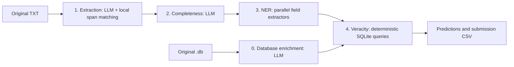

# Jusbrasil BRACIS 2026 — Caça-Alucinações

This pipeline finds legal citations in TXT documents, extracts their structured fields, and verifies them against a canonical SQLite database. For each citation it outputs a span, a class (`real`, `inventada` or `incompleta`), a canonical ID for real citations, and a confidence value.

Everything runs offline on one GPU with 24 GB of VRAM, with a single open model served locally by vLLM: [`google/gemma-4-12B-it-qat-w4a16-ct`](https://huggingface.co/google/gemma-4-12B-it-qat-w4a16-ct).

## Final evaluation: how to run

### Requirements

- Linux with one NVIDIA GPU with at least 24 GB of VRAM (developed for an RTX 4090), recent NVIDIA drivers and the NVIDIA Container Toolkit.
- Docker. Nothing else is needed on the host: vLLM, Python and the model weights live in the image.
- Internet access **only to build the image**, which downloads the dependencies and the model weights. Execution needs no network and calls no external API.

### Build

```bash
docker build -t desafio-jusbrasil .
```

The image is based on `vllm/vllm-openai:v0.30.0` and downloads the model weights at a fixed revision (`1d2c2d7f2466070e69d6fb3fd5ce9a7d75f2f6ee`) into the image. No weights are fetched at run time.

### Run (single entry point)

From the repository root, on the host:

```bash
bash run.sh <path_db> <txt_folder> <output_file>
```

`<path_db>` is a database in the original format of the development sample (`desafio1_bracis.db`), and `<txt_folder>` contains one `<documento_id>.txt` per document. The output is a CSV in the submission format (`documento_id,citacoes`, with `inicio,fim,classe,id_canonico,confianca` entries separated by `|`, and `-` for documents without citations), produced by [`scripts/json_to_submission.py`](scripts/json_to_submission.py).

If `<output_file>` is a folder, the CSV is written as `submission.csv` inside it.

[`run.sh`](run.sh) builds the image if it does not exist yet (`IMAGEM` overrides the tag, default `desafio-jusbrasil:latest`) and runs it with `--network none`, mounting the database, the TXT folder (read-only), the output folder and `outputs/`. Inside the container, [`scripts/run_in_container.sh`](scripts/run_in_container.sh) performs every step without manual intervention:

1. Starts vLLM on `127.0.0.1:8000` with the pinned model revision and waits until it responds.
2. **Enriches the database** given as input into a new copy (`outputs/final/enriched.db`) using the code in `src/desafio_jusbrasil/database_preprocessing`. The original database is never modified.
3. Runs the four pipeline stages on the TXT folder against the enriched copy.
4. Writes the submission CSV and stops the server.

Intermediate checkpoints, audits and the vLLM log (`outputs/final/vllm.log`) are written to `outputs/` in the repository, owned by the host user. `GPUS` selects the GPU passed to Docker (default `all`, e.g. `GPUS='"device=0"'`).

The image can also be run directly, without `run.sh`:

```bash
docker run --rm --gpus all --network none --ipc=host \
  -v /path/to/data:/dados -v /path/to/output:/saida \
  desafio-jusbrasil /dados/<base>.db /dados/<txt_folder> /saida/submission.csv
```

### Running without Docker

On a machine with the GPU, `vllm` (v0.30.0) installed in the project environment and the model weights already in the Hugging Face cache, the in-container script runs directly:

```bash
uv sync
huggingface-cli download google/gemma-4-12B-it-qat-w4a16-ct \
  --revision 1d2c2d7f2466070e69d6fb3fd5ce9a7d75f2f6ee
bash scripts/run_in_container.sh desafio-jusbrasil-bracis-2026/desafio1_bracis.db \
  desafio-jusbrasil-bracis-2026/txt outputs/submission.csv
```

The script sets `HF_HUB_OFFLINE=1`, so the weights must be downloaded beforehand.

### Execution settings

| Setting | Value | Where |
| --- | --- | --- |
| Model | `google/gemma-4-12B-it-qat-w4a16-ct`, revision `1d2c2d7…` | `Dockerfile`, `scripts/run_in_container.sh` |
| Server | vLLM `v0.30.0`, `--max-model-len 16384`, `--gpu-memory-utilization 0.90`, `--seed 0` | `scripts/run_in_container.sh` |
| Sampling | `temperature: 0` in every model call | `configs/final_*.yaml` |
| Concurrency | 8 requests | `configs/final_*.yaml` |
| Pipeline config | [`configs/final_pipeline.yaml`](configs/final_pipeline.yaml) | |
| Enrichment config | [`configs/final_database_preprocessing.yaml`](configs/final_database_preprocessing.yaml) | |

Inside the container, `MAX_MODEL_LEN`, `GPU_MEMORY_UTILIZATION`, `PORTA` and `WORKDIR` can be overridden through environment variables.

### Reproducibility

- All model calls use `temperature: 0` and the server runs with `--seed 0`. There is no sampling.
- The model revision, the vLLM image and the Python dependencies (`uv.lock`) are pinned.
- No absolute paths, manual steps or files outside the repository: the only extra artifact, the judge-name dictionary `data/relatores_padronizacao.json`, is versioned, included in the image and copied next to the enriched database.
- Small numeric differences can still come from GPU kernels and request batching in vLLM.

### Compliance with the submission rules

| Rule | How it is met |
| --- | --- |
| Complete code | `src/desafio_jusbrasil/` (pipeline and database enrichment), `scripts/`, `configs/` |
| README with approach and steps | This file |
| Declared environment (Docker) | [`Dockerfile`](Dockerfile); `run.sh` executes everything inside it |
| Model weights at a fixed revision | Downloaded during `docker build`, revision `1d2c2d7f2466070e69d6fb3fd5ce9a7d75f2f6ee` |
| Single entry point | `bash run.sh <path_db> <txt_folder> <output_file>` |
| GPU with up to 24 GB | One 12B model quantized to 4 bits (W4A16), 16k-token context |
| Offline | Local vLLM server inside the container; `HF_HUB_OFFLINE=1`; `run.sh` uses `docker run --network none` |
| Clean machine, no absolute paths | All paths are arguments or relative to the repository |
| Enrichment code for a new `.db` | Each execution regenerates the enriched copy from the database it receives |
| Development-only models | Not used at run time; only the model above is executed |

## Approach



### 0. Database enrichment

The canonical database stores most identifiers only inside the document text. Enrichment copies the database and adds structured columns that stage 4 can query:

- **Acórdãos:** CNJ number of the judged case, sequential number with the court class, court registry number, main procedural class, appeal chain (`cadeia_recursal`) and UF.
- **Súmulas:** number and whether it is binding (`vinculante`).
- **Legal provisions:** normalized legal instrument, instrument number and article.
- `relator_norm`: deterministic normalization of the judge's name with `data/relatores_padronizacao.json`.

Each document is sent once to the model with a per-type prompt, few-shot examples (`configs/few_shot_database_preprocessing.json`) and a JSON schema with closed vocabularies. Acórdãos are cut to their first 10,000 and last 2,000 characters, where these metadata usually appear. Numeric fields keep digits only, and CNJ numbers are validated against the text. If a document fails after the retries, the database is still materialized and that document keeps null columns (`run.sh` falls back to `--materializar`).

### 1. Extraction

The LLM returns the citation text and type. Python computes the offsets; the model never generates them.

The extractor first searches for the returned text literally. If that fails, it tries whitespace-normalized matching and maps the result back to the original document. A located citation stores the original slice `texto[inicio:fim]`, preserving its formatting. Offsets are Unicode character positions with an exclusive end.

Oversized documents are split into overlapping chunks with token budgets and capacity-error handling. With `tokenizer_path: /tokenize`, token counts come from the vLLM server. Chunk offsets are translated to document offsets, and duplicate spans are merged. See [extraction limits and chunking](docs/extraction-limits.md).

Unlocated candidates never enter the final submission.

### 2. Completeness

An LLM returns `completa: true` or `false`, using the citation and ±300 characters of context. It does not query the database or decide whether a citation is invented.

The prompts require a searchable numbered reference for jurisprudence (case number, súmula or theme) and a numbered provision plus an identifiable legal instrument for legislation. Context may join parts of the same reference but must not supply identifiers from a different citation.

The call also requests token log-probabilities. The probability that the citation is incomplete is read from the `true`/`false` token of the answer and normalized between the two values. It is the confidence used for `incompleta` (see [Confidence](#confidence)).

### 3. Parallel NER

Each extractor receives the original citation text and returns only its assigned fields. All calls use the same model; they run independently within a shared concurrency limit.

| Extractor | Fields |
| --- | --- |
| Nature | `natureza`, `numero_sumula`, `sumula_vinculante` |
| Identifiers | `numero_processo_cnj`, `numero_classe_tribunal`, `numero_registro_tribunal` |
| Process class | `classe_processual`, `cadeia_recursal` |
| Court | `tribunal` |
| State | `uf` |
| Year | `ano` |
| Judge | `relator` |
| Legal instrument and article | `diploma`, `numero_artigo` |
| Legal instrument number | `numero_diploma` |

Jurisprudence uses the first seven extractors; legislation uses the last two. The coordinator merges their fields and applies deterministic normalization, including CNJ handling and judge-name normalization into `relator_norm`.

Each system prompt contains shared evidence rules, field-specific instructions, synthetic examples and the response JSON schema. Allowed values, including all 27 UF codes, come from the Python contracts. Each response is capped at 512 tokens; failed requests are retried and audited, never silently converted into empty fields. See [parallel entity extraction](docs/parallel-entity-extraction.md).

### 4. Veracity

The verifier runs parameterized, read-only SQLite queries against the enriched columns. It does not call an LLM.

| Condition | Result | Confidence |
| --- | --- | --- |
| `completa: false`, or entity output unavailable | `incompleta` (no lookup) | Stage 2 probability |
| Extracted fields cannot form a supported query | `incompleta` | Stage 2 probability |
| The query finds no matching record | `inventada` | 0.75 |
| One canonical record matches | `real` with its canonical ID | 1.0 |
| Several records remain after disambiguation by court, UF, year and judge | `real` with the smallest ID among them | 0.0 |

A separate `4_veracity_fts` module exists as an alternative implementation; it is not used by `run.sh` and does not set confidence.

### Confidence

The official metric adds a Brier-based bonus over matched citations, where the target is 1 when the predicted class (and, for `real`, the canonical ID) is correct. Confidence therefore estimates whether the **final class** is right, not whether the span was extracted correctly, and it is set where that class is decided:

- `real` and `inventada`: constants set by stage 4 from the query outcome. On the development sample, single-record `real` was always correct, and about 75% of `inventada` were correct.
- `incompleta`: the stage 2 probability that the citation is incomplete, from the model's log-probabilities. In a comparison on the development sample, it scored the same as asking the model to write a confidence value, which was always 1.0 and carried no information.
- When stage 2 returns no probability, the confidence is omitted (`-`), which removes the citation from the Brier term instead of penalizing it.

Materialization takes the confidence from stage 4 only.

## Development

### Setup

Use Python 3.12 or newer:

```bash
uv sync
cp .env.example .env
```

Set `OPENAI_API_KEY` in the environment or `.env`. For a local endpoint without authentication, the SDK still needs a nonempty placeholder such as `dummy`. Do not commit real credentials.

The stage CLIs read a YAML config with `input_dir`, `workdir`, `database` and a model section per stage (`extractor`, `completeness`, `entities`). Paths are resolved from the working directory, so run the commands from the project root. Configs under `configs/` other than `final_*` are development experiments and may point to remote endpoints.

| Setting | Behavior |
| --- | --- |
| `temperature`, `top_p`, `top_k`, `reasoning_effort` | Null omits the setting and uses the server default. |
| `async_requests` | Enables concurrent extraction/completeness when using their standalone stage CLIs. |
| `max_concurrency` | Limits concurrent work; for NER, the shared runner limits individual LLM requests. |
| `entities.max_retries` | Maximum application attempts per extractor call. |
| `entities.request_timeout_seconds` | Per-attempt timeout, excluding time waiting for a concurrency slot. |
| `extractor.debug` | Keeps unlocated candidates in intermediate checkpoints when true. |
| `extractor.context_window_tokens`, `max_output_tokens`, `token_margin` | Control the extraction input/output budget. The smaller of the configured and server-reported context is used. |
| `extractor.chunk_overlap_chars` | Adds shared context between extraction chunks. |
| `extractor.tokenizer_path` | Tokenizer endpoint (`/tokenize` for vLLM); otherwise extraction uses a conservative byte-based estimate. |

The entity coordinator and the enrichment both load `relatores_padronizacao.json` from the database's directory.

### Running stages separately

```bash
uv run python -m desafio_jusbrasil.database_preprocessing --config configs/final_database_preprocessing.yaml
uv run desafio-jusbrasil --config configs/final_pipeline.yaml
```

The enrichment CLI accepts `--input`, `--output` and `--audit-dir`, and `--materializar` builds the database from existing results without calling the model. The pipeline CLI accepts `--input-dir`, `--workdir` and `--database`. The stages can also run one at a time, each consuming the previous stage's checkpoints:

```bash
uv run python -m desafio_jusbrasil.1_extractor --config configs/final_pipeline.yaml
uv run python -m desafio_jusbrasil.2_completeness --config configs/final_pipeline.yaml
uv run python -m desafio_jusbrasil.3_entities --config configs/final_pipeline.yaml
uv run python -m desafio_jusbrasil.4_veracity --config configs/final_pipeline.yaml
```

Use a fresh `workdir` for each experiment. The last command also exports the final prediction JSON files.

### Evaluation and reports

Generate local stage references from the published development annotations:

```bash
uv run scripts/generate_stage_golds.py --output outputs/gold
```

Entity references also use local normalization and reviewed overrides; they are development annotations, not an independent benchmark. See [gold rules](docs/gold-rules.md).

```bash
uv run scripts/evaluate_extraction.py outputs/my-run --gold outputs/gold
uv run scripts/evaluate_completeness.py outputs/my-run --gold outputs/gold
uv run scripts/evaluate_entities.py outputs/my-run --gold outputs/gold
uv run scripts/evaluate_veracity.py outputs/my-run --gold outputs/gold
uv run scripts/clear_outputs.py outputs/my-run --gold outputs/gold
uv run python scripts/evaluate_database_preprocessing.py outputs/database-preprocessing/<run>
```

`clear_outputs.py` reads saved results without model calls and writes readable reports to `outputs/clear_outputs/<date-and-time>/`. See [readable report details](docs/clear-outputs.md).

To score a run with the official competition metric:

```bash
uv run python scripts/json_to_submission.py outputs/my-run/predictions outputs/my-run/submission.csv
uv run python scripts/evaluate.py outputs/my-run/submission.csv
```

These commands create and score local files; they do not submit anything to Kaggle.

### Development results

On the 26 development documents, a full run with `google/gemma-4-12B-it-qat-w4a16-ct`, temperature 0 and a database enriched by the same model (`outputs/run-20-gemma4-12B-it-qat`) scored **0.941** on the official metric, before the current confidence rules. A previous v2 run against the reference-enriched database (`data/desafio1_bracis_enriched_gold.db`) reached a strict overall F1 of 91.43%; see [the full v2 evaluation](reports/full-pipeline-v2-20260928.md).

The prompts use synthetic demonstrations, but the development corpus also informed prompt development. These numbers are development results, not an unseen-data benchmark. Run artifacts under `outputs/` are local and excluded from Git.

### Checkpoints and audits

Each stage writes `<stage>/<document_id>/resultado.json` and numbered audit files under `01-extraction`, `02-completeness`, `03-entities` and `04-veracity`; final JSON files are in `predictions/`. Audits record the requests, responses, attempts and timings of model calls, and the SQL, parameters, matched records and classification of each verification. Stage manifests record the configuration. Evaluators ignore manifests and numbered audit files.

### Tests

```bash
uv run python -m unittest discover -s tests
```

The 74 tests run without inference.

### Known limitations

- Citations are not repaired or expanded when fragmented, and jurisprudence is not searched by court, year and judge alone; those references are `incompleta`. A design for this is in [v3_suggestion.md](v3_suggestion.md).
- When several records match, the smallest ID is a deterministic choice, not a disambiguation.
- The judge-name dictionary was built from the development database; names outside it are not normalized.
- Enrichment with the 12B model agrees less with the reference metadata than larger models; fields it misses can turn real citations into `inventada`.
